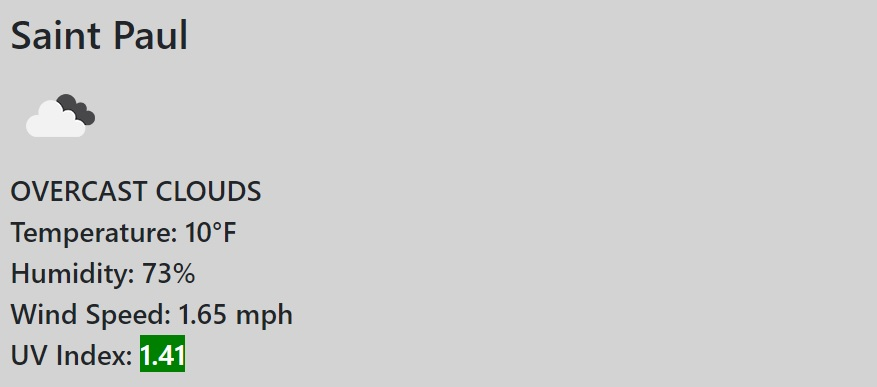

# weatherAPI
The goal of this project is to create a weather app using a weather API. When the page is loaded, you see a search bar.  Type in the city and that will append a button underneath a search bar.  When you type in another city, it adds that city to the list of previously searched cities.  

When you click on the button for a previous result, it will update the date and display the current weather for that particular city as shown in the screen shot below.

The font color for the UV index is updated to indictate the level of risk as rated by the World Health Organization.  A visual representation of the color scheme is below.

-------------------
Link to github repo: https://github.com/jimnguyen220/weatherAPI

Link to live website: https://jimnguyen220.github.io/weatherAPI/

--------------------

## Resources:

https://openweathermap.org/

https://momentjs.com/

https://getbootstrap.com

https://www.who.int/uv/publications/en/UVIGuide.pdf