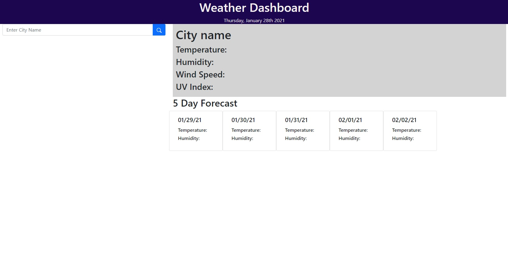

# weatherAPI
The goal of this project is to create a weather app using a weather API. The scenario is to design an app for a traveler who will want to visit multiple cities.  When the page is loaded, you see a search bar.  You will also notice that the current date is displayed on the top navigation bar.  This date is updated using momentjs.com.  

Type in the city and hit the search icon.  This will display the city name, weather conditions, humidity, wind speed and UV index.  It will also update the 5 day forecast to help with any planning while visiting that city.  To help with travel plans, the name of that city that will append as a button underneath a search bar to make it easy to recall that information.  Clicking that button will update the page with that particular cities information.  

You may notice that the UV index color changes depending on the value. A visual representation of the color scheme is below.  The chart is from the World Health Organization for UV index.

-------------------
Link to github repo: https://github.com/jimnguyen220/weatherAPI

Link to live website: https://jimnguyen220.github.io/weatherAPI/

--------------------

## Resources:

https://openweathermap.org/

https://momentjs.com/

https://getbootstrap.com

https://www.who.int/uv/publications/en/UVIGuide.pdf